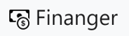
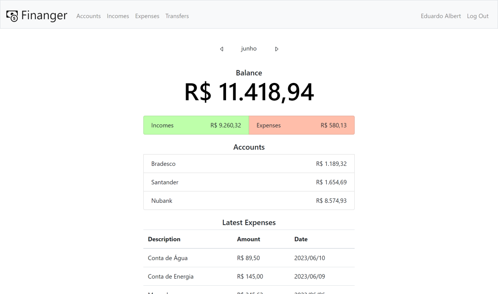

<h1 align="center">
    
</h1>

A web application made in flask that aims to help you keep track of your finances.

Watch a demo video [here](https://youtu.be/0eIWzRdFcVo).

## Application Setup
A Flask application is an instance of the Flask class and is where the application's configurations are registered.

In this project, instead of using a global instance of Flask, the so-called application factory is used, a function found in the *\_\_init\_\_.py* file, in which any configuration and other application settings are defined, such as the path to the database, the Jinja filters added and the registration of the blueprints (sets of related views).

After these definitions, this function returns the application.

## Database
The database for this application is very simple, that's why SQLite was chosen. The *schema.sql* file contains the SQL commands for creating the tables, which include tables for user data, accounts, transactions and transaction types.

The *db.py* file allows us to interact with the database, it contains functions to initialize the DB by running the *schema.sql* commands, open connection and close connection. It was also defined that the closing of the connection will occur automatically at the end of each request.

## Base Template and Style
Flask uses the Jinja template library to render templates. In turn, Jinja allows us to create a base template that will be used by all other templates, eliminating the repetition of common code between files.

Inside the **templates** folder, the *base.html* file fulfills this role, it contains the necessary links and scripts for using Bootstrap, the web framework used in this application. It also contains the navigation bar, a section with blocks for implementing the specific content of each template and a div to show error or success messages after a request.

In the **static** folder, there are some used icons and the *style.css* file that defines the page's styling.

## utils.py
Another thing Jinja allows us to do is add filters that will be used when rendering a template. In the *utils.py* file there are some filters created for this application. Like `brl`, which formats a value according to the Brazilian currency, and `day_name_number`, which takes a date like YYYY/MM/DD and returns the abbreviated day name and day number.

In addition, at the top of some templates, the user can navigate through the months using two arrows, which allows he to view what was recorded in different months and years, such as transactions that took place in a given month of a given year. In the **utils.py** file, a function called `set_date` is defined, which allows the user to perform the correct alternation between months and years.

## Authentication
The first page that the user sees upon entering is the authentication page. If he is a new user, he must register. If he already have a registration, he just has to provide the username and password correctly in the login form.

In **templates**, inside the **auth** folder, *register.html* and *login.html* files contain HTML codes related to the authentication pages, basically forms that must be filled out and submitted.

The authentication-related routes are defined in the *auth.py* file, with a function to load user information and views functions that verify the information provided for registration or login, and also the one that allows the user to logout. Each returning the appropriate template at the end, along with an error or success message.

After logging in, the user's data is saved in the session and he remains logged in, even if he closes the application, until the session is ended.

In addition, this file defines the `login_required` function, which only allows logged-in users to have access to certain routes and redirects them to the authentication route if they are not.

## Dashboard
After registering and logging in, the user will be redirected to the Finanger Dashboard. Where he can see the balance (which is calculated by the sum of his account totals) his total income and expenses in the selected month, a list with all his registered accounts and another one with the most recent expenses registered.

In **templates**, the HTML code of the page is found in the *main.html* file, inside the **dashboard** folder.

In the *dashboard.py* file, a view function is defined that selects data related to accounts and transactions, performs the necessary calculations and returns the results to be displayed in the template. Also in *dashboard.py*, there is the `set_current_date` function that records the current month and year, so the first records displayed will always be the most current.

## Accounts (Where is my money?)
When accessing the accounts page, the user can view a list with all accounts and their respective totals. It is possible to add a new account by clicking on the ***Add account*** button and filling out the form accordingly. The user can also edit account data by clicking ***Edit*** button. He can also delete it by clicking the ***Delete*** button found on the page he was redirected to by clicking on ***Edit***.

All these functionalities have been programmed in the *accounts.py* file, along with the definition of the corresponding routes. The view function `delete` determines that when an account is deleted, all transactions related to it are also deleted. Also inside the *accounts.py* file, the `get_account` function is written, which is useful to get all the accounts of a user and to check if a certain account belongs to the user who is trying to access.

In **templates**, inside the accounts folder, the *add.html* and *update.html* files contain forms for adding and updating account data, respectively. The *main.html* file contains the list for displaying accounts.

## Transactions (What am i doing with my money?)
In Finanger, the user can record transactions such as incomes, expenses and transfers made between their own accounts.

### Incomes and Expenses
When entering the income or expense page, the user can view a table that displays the description, amount, account, and day the transaction occurred in the selected month. By clicking on the ***New income*** or ***New expense*** button, it is possible to add a new transaction. The user can also edit or delete it by clicking the ***Edit*** button.

When deleting an income transaction, the amount is removed from the appropriate account. When deleting an expense transaction, the amount is returned to the appropriate account.

Such functionalities have been programmed in the *transactions.py* file, along with the definition of the related routes. The `get_transaction` function allows getting all transactions of a certain type and is also useful to check if a user is the owner of a certain transaction.

Within **templates**, in the **transactions** folder, the files *main.html*, *add.html* and *update.html* contain the formatting of the table, form for addition and form for updating account data, respectively.

It is also possible to view incomes and expenses in a single list. Entering the Dashboard and clicking on the balance, a list of incomes and expenses for the selected month will be displayed. The formatting of this list is found in the *all.html* file.

### Transfers
On the transfers page, the user can view a table that displays the description, amount, origin account, destination account and the day the transfer occurred in the selected month. By clicking on the ***New transfer*** button, it is possible to add a new transfer. It is also possible to delete by clicking the ***Delete*** button in the respective row.

Although they are stored in the same table where the incomes and expenses are, the transfers are programmed in a different place, in the *transfers.py* file, due to differences when adding and deleting. Inside are the views functions and related routes. The `do_transfer` function can be used to perform a transfer when it is added and to do the reverse process when it is deleted.

In **templates**, in the **transfers** folder, the *main.html* file contains the formatting of the page itself and the transfer table. The *add.html* file contains the form to add a new transfer.

## Contribution

I would be delighted to receive your contributions to enhance the Finanger. Feel free to open issues or submit pull requests with improvements.

## License

This project is licensed under the MIT License. See the [LICENSE](LICENSE) file for details.
